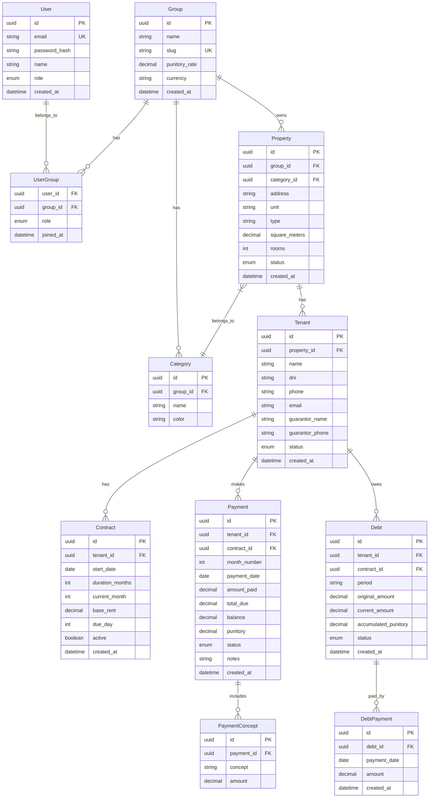

# SRS - Sistema de Gestión Inmobiliaria MultiUsuario

**Versión:** 1.0
**Fecha:** 5 de Febrero, 2026
**Autor:** Arquitecto de Software
**Estado:** Pendiente de Aprobación

---

## 1. INFORMACIÓN DEL PROYECTO

### 1.1 Resumen Ejecutivo
Sistema web completo para gestión de propiedades inmobiliarias, inquilinos, pagos y deudas. Migración del sistema actual basado en Google Sheets/Apps Script a una aplicación web moderna, escalable y multi-tenant.

### 1.2 Alcance (Scope)
- **IN SCOPE:** Gestión de propiedades, inquilinos, contratos, pagos, deudas, reportes, multi-tenancy
- **OUT OF SCOPE:** Contabilidad avanzada, facturación electrónica AFIP, integración bancaria automática

### 1.3 Stakeholders
| Rol | Nombre/Descripción | Responsabilidad |
|-----|-------------------|-----------------|
| Product Owner | Dueños inmobiliarias (H&H) | Aprobar features, definir prioridades |
| Usuarios Finales | Paco, Pedro | Usar el sistema diariamente |
| Integradores | n8n/Automatizaciones | Consumir API REST |
| Desarrollador | Equipo técnico | Implementar y mantener |

---

## 2. ANÁLISIS DEL SISTEMA ACTUAL (Migración)

### 2.1 Archivos a Migrar
```
/home/francisco/Excel/
├── Código.gs           (181KB) - Lógica principal
├── Menu.gs             - Menús UI
├── RegistrarPago.gs    - Registro de pagos
├── GenerarReportes.gs  - Generación reportes
├── AlertasContratos.gs - Alertas vencimientos
├── PrepararNuevoMes.gs - Cierre mensual
├── ConfirmarAjustes.gs - Ajustes de montos
├── ListasPropiedades.gs- Listas desplegables
├── ReporteImpuestos.gs - Reportes fiscales
├── Utilidades.gs       - Helpers
├── Wrappers.gs         - Funciones wrapper
├── formulario.html     - UI registro pago
├── formularioReporte.html - UI reportes
└── formularioImpuestos.html - UI impuestos
```

### 2.2 Entidades del Sistema Actual
1. **Propiedades:** Agrupadas por categoría (VARIOS, MATIENZO, LOCAL)
2. **Inquilinos:** Vinculados a propiedades con contratos
3. **Pagos:** Alquiler base + IVA + Impuestos + Gastos Comunes + Rentas + Municipal + Expensas + Agua + Seguro
4. **Deudas:** Generadas al cierre mensual para pagos incompletos
5. **Punitorios:** Calculados automáticamente (0.6% diario sobre alquiler base)
6. **Contratos:** Con fecha inicio, término, alertas de vencimiento

---

## 3. REQUERIMIENTOS FUNCIONALES

### 3.1 Módulo de Autenticación y Autorización
| ID | Requerimiento | Prioridad |
|----|--------------|-----------|
| RF-001 | Login con email/password | MUST |
| RF-002 | Registro de usuarios con invitación | MUST |
| RF-003 | Roles: SuperAdmin, Admin, Operador, Viewer | MUST |
| RF-004 | Multi-tenancy: Usuarios pertenecen a Grupos/Inmobiliarias | MUST |
| RF-005 | JWT tokens con refresh | MUST |
| RF-006 | Recuperación de contraseña por email | SHOULD |

### 3.2 Módulo de Grupos/Inmobiliarias
| ID | Requerimiento | Prioridad |
|----|--------------|-----------|
| RF-010 | CRUD de Grupos (Inmobiliarias) | MUST |
| RF-011 | Invitar usuarios a grupos | MUST |
| RF-012 | Un usuario puede pertenecer a múltiples grupos | MUST |
| RF-013 | Configuración por grupo (punitorios %, moneda) | SHOULD |

### 3.3 Módulo de Propiedades
| ID | Requerimiento | Prioridad |
|----|--------------|-----------|
| RF-020 | CRUD de Propiedades | MUST |
| RF-021 | Categorizar propiedades (VARIOS, MATIENZO, LOCAL, custom) | MUST |
| RF-022 | Campos: dirección, tipo, metros², habitaciones | MUST |
| RF-023 | Estado: Disponible, Alquilada, Mantenimiento | MUST |
| RF-024 | Historial de inquilinos por propiedad | SHOULD |
| RF-025 | Documentos adjuntos (fotos, contratos PDF) | COULD |

### 3.4 Módulo de Inquilinos
| ID | Requerimiento | Prioridad |
|----|--------------|-----------|
| RF-030 | CRUD de Inquilinos | MUST |
| RF-031 | Datos: nombre, DNI, teléfono, email, garante | MUST |
| RF-032 | Contrato: fecha inicio, duración meses, monto base | MUST |
| RF-033 | Vincular inquilino a propiedad | MUST |
| RF-034 | Estado: Activo, Inactivo, Moroso | MUST |
| RF-035 | Alertas automáticas contratos próximos a vencer (2 meses) | MUST |

### 3.5 Módulo de Pagos
| ID | Requerimiento | Prioridad |
|----|--------------|-----------|
| RF-040 | Registrar pago (monto, fecha, método) | MUST |
| RF-041 | Conceptos configurables: Alquiler, IVA, Impuestos, GC, Rentas, Muni, Expensas, Agua, Seguro | MUST |
| RF-042 | Descuentos y saldos a favor | MUST |
| RF-043 | Cálculo automático de punitorios (configurable %) | MUST |
| RF-044 | Estados: Pendiente, Parcial, Completo | MUST |
| RF-045 | Registro de abonos parciales múltiples | MUST |
| RF-046 | Historial completo de pagos | MUST |

### 3.6 Módulo de Deudas
| ID | Requerimiento | Prioridad |
|----|--------------|-----------|
| RF-050 | Generación automática de deudas al cierre mensual | MUST |
| RF-051 | Deudas por propiedad con punitorios acumulados | MUST |
| RF-052 | Pago de deudas (cancela deuda al pagar) | MUST |
| RF-053 | Dashboard de deudas por inquilino/propiedad | MUST |

### 3.7 Módulo de Reportes
| ID | Requerimiento | Prioridad |
|----|--------------|-----------|
| RF-060 | Generar recibo de pago PDF | MUST |
| RF-061 | Reporte mensual por propiedad | MUST |
| RF-062 | Reporte de impuestos (anual) | MUST |
| RF-063 | Exportar a Excel (.xlsx) | MUST |
| RF-064 | Compartir reporte por email/link | SHOULD |
| RF-065 | Dashboard con métricas: ingresos, deudas, ocupación | SHOULD |

### 3.8 Módulo de Cierre Mensual
| ID | Requerimiento | Prioridad |
|----|--------------|-----------|
| RF-070 | Preparar nuevo mes (limpiar pagos, crear deudas) | MUST |
| RF-071 | Traspasar saldos a favor al mes siguiente | MUST |
| RF-072 | Backup automático del mes cerrado | MUST |
| RF-073 | Incremento automático del número de mes en contratos | SHOULD |

### 3.9 API REST para Integraciones
| ID | Requerimiento | Prioridad |
|----|--------------|-----------|
| RF-080 | API RESTful documentada (OpenAPI/Swagger) | MUST |
| RF-081 | Autenticación API via API Keys | MUST |
| RF-082 | Rate limiting | SHOULD |
| RF-083 | Webhooks para eventos (nuevo pago, nueva deuda) | COULD |

---

## 4. REQUERIMIENTOS NO FUNCIONALES

| ID | Requerimiento | Criterio de Aceptación |
|----|--------------|----------------------|
| RNF-001 | Responsive Design | Mobile-first, funciona en 320px+ |
| RNF-002 | Performance | Tiempo de carga < 3s, API < 500ms |
| RNF-003 | Seguridad | OWASP Top 10, HTTPS, sanitización |
| RNF-004 | Escalabilidad | Soportar 100 usuarios concurrentes |
| RNF-005 | Disponibilidad | 99% uptime |
| RNF-006 | UI/UX | Interfaz moderna, intuitiva, bonita |
| RNF-007 | Accesibilidad | WCAG 2.1 nivel A |

---

## 5. ARQUITECTURA TÉCNICA

### 5.1 Tech Stack

| Capa | Tecnología | Justificación |
|------|-----------|---------------|
| **Frontend** | React 18 + Vite | Rápido, moderno, gran ecosistema |
| **Styling** | Tailwind CSS + DaisyUI | Utility-first, componentes bonitos listos |
| **State** | Zustand + TanStack Query | Ligero, cache inteligente |
| **Backend** | Node.js + Express | JavaScript fullstack, fácil mantenimiento |
| **ORM** | Prisma | Type-safe, migraciones automáticas |
| **Base de Datos** | PostgreSQL (Supabase) | Gratis, escalable, Row Level Security |
| **Auth** | JWT + bcrypt | Simple, stateless, seguro |
| **PDF** | jsPDF + html2canvas | Generación client-side |
| **Excel** | SheetJS (xlsx) | Lectura/escritura Excel |
| **Deploy FE** | Vercel | Gratis, CDN global, preview deploys |
| **Deploy BE** | Render | Gratis tier, auto-deploy |

### 5.2 Diagrama de Base de Datos (ERD)



### 5.3 Estructura del Backend

```
backend/
├── prisma/
│   ├── schema.prisma
│   └── migrations/
├── src/
│   ├── controllers/
│   │   ├── authController.js
│   │   ├── groupsController.js
│   │   ├── categoriesController.js
│   │   ├── propertiesController.js
│   │   ├── tenantsController.js
│   │   ├── contractsController.js
│   │   ├── paymentsController.js
│   │   ├── debtsController.js
│   │   └── reportsController.js
│   ├── routes/
│   │   ├── index.js
│   │   ├── auth.routes.js
│   │   ├── groups.routes.js
│   │   ├── categories.routes.js
│   │   ├── properties.routes.js
│   │   ├── tenants.routes.js
│   │   ├── contracts.routes.js
│   │   ├── payments.routes.js
│   │   ├── debts.routes.js
│   │   └── reports.routes.js
│   ├── services/
│   │   ├── authService.js
│   │   ├── paymentService.js
│   │   ├── debtService.js
│   │   ├── reportService.js
│   │   └── monthlyCloseService.js
│   ├── middleware/
│   │   ├── auth.js
│   │   ├── groupAuth.js
│   │   ├── roleAuth.js
│   │   ├── validate.js
│   │   └── errorHandler.js
│   ├── utils/
│   │   ├── jwt.js
│   │   ├── password.js
│   │   ├── punitory.js
│   │   ├── dateHelpers.js
│   │   └── apiResponse.js
│   ├── validators/
│   │   ├── authValidators.js
│   │   ├── propertyValidators.js
│   │   └── paymentValidators.js
│   ├── config/
│   │   └── index.js
│   └── app.js
├── package.json
└── .env
```

### 5.4 Estructura del Frontend

```
frontend/
├── public/
├── src/
│   ├── components/
│   │   ├── ui/           # Componentes reutilizables
│   │   ├── layout/       # Header, Sidebar, Footer
│   │   ├── forms/        # Formularios
│   │   └── tables/       # Tablas de datos
│   ├── pages/
│   │   ├── auth/
│   │   │   ├── Login.jsx
│   │   │   └── Register.jsx
│   │   ├── dashboard/
│   │   │   └── Dashboard.jsx
│   │   ├── properties/
│   │   │   ├── PropertyList.jsx
│   │   │   └── PropertyForm.jsx
│   │   ├── tenants/
│   │   │   ├── TenantList.jsx
│   │   │   └── TenantForm.jsx
│   │   ├── payments/
│   │   │   ├── PaymentList.jsx
│   │   │   └── PaymentForm.jsx
│   │   ├── debts/
│   │   │   └── DebtList.jsx
│   │   └── reports/
│   │       └── Reports.jsx
│   ├── hooks/
│   │   ├── useAuth.js
│   │   ├── useProperties.js
│   │   ├── useTenants.js
│   │   └── usePayments.js
│   ├── services/
│   │   └── api.js
│   ├── store/
│   │   ├── authStore.js
│   │   └── uiStore.js
│   ├── utils/
│   │   ├── formatters.js
│   │   ├── validators.js
│   │   └── pdfGenerator.js
│   ├── App.jsx
│   └── main.jsx
├── tailwind.config.js
├── vite.config.js
└── package.json
```

### 5.5 API Endpoints

```
BASE URL: /api/v1

AUTENTICACIÓN
├── POST   /auth/register          # Registrar usuario
├── POST   /auth/login             # Login
├── POST   /auth/refresh           # Refresh token
├── POST   /auth/forgot-password   # Solicitar reset
├── POST   /auth/reset-password    # Resetear password
└── GET    /auth/me                # Usuario actual

GRUPOS
├── GET    /groups                 # Listar mis grupos
├── POST   /groups                 # Crear grupo
├── GET    /groups/:id             # Detalle grupo
├── PUT    /groups/:id             # Actualizar grupo
├── DELETE /groups/:id             # Eliminar grupo
├── POST   /groups/:id/invite      # Invitar usuario
└── GET    /groups/:id/members     # Listar miembros

CATEGORÍAS (dentro de grupo)
├── GET    /groups/:gid/categories
├── POST   /groups/:gid/categories
├── PUT    /groups/:gid/categories/:id
└── DELETE /groups/:gid/categories/:id

PROPIEDADES
├── GET    /groups/:gid/properties
├── POST   /groups/:gid/properties
├── GET    /groups/:gid/properties/:id
├── PUT    /groups/:gid/properties/:id
└── DELETE /groups/:gid/properties/:id

INQUILINOS
├── GET    /groups/:gid/tenants
├── POST   /groups/:gid/tenants
├── GET    /groups/:gid/tenants/:id
├── PUT    /groups/:gid/tenants/:id
├── DELETE /groups/:gid/tenants/:id
└── GET    /groups/:gid/tenants/:id/history

CONTRATOS
├── GET    /groups/:gid/contracts
├── POST   /groups/:gid/contracts
├── GET    /groups/:gid/contracts/:id
├── PUT    /groups/:gid/contracts/:id
└── GET    /groups/:gid/contracts/expiring  # Próximos a vencer

PAGOS
├── GET    /groups/:gid/payments
├── POST   /groups/:gid/payments
├── GET    /groups/:gid/payments/:id
├── PUT    /groups/:gid/payments/:id
├── GET    /groups/:gid/payments/pending    # Pagos pendientes
└── GET    /groups/:gid/payments/history    # Historial

DEUDAS
├── GET    /groups/:gid/debts
├── POST   /groups/:gid/debts/:id/pay       # Pagar deuda
└── GET    /groups/:gid/debts/summary       # Resumen deudas

REPORTES
├── GET    /groups/:gid/reports/receipt/:paymentId   # Recibo PDF
├── GET    /groups/:gid/reports/monthly/:period      # Reporte mensual
├── GET    /groups/:gid/reports/taxes/:year          # Reporte impuestos
├── GET    /groups/:gid/reports/export/excel         # Exportar Excel
└── GET    /groups/:gid/reports/dashboard            # Métricas dashboard

OPERACIONES
├── POST   /groups/:gid/operations/close-month       # Cierre mensual
└── POST   /groups/:gid/operations/adjust-amounts    # Ajustar montos
```

---

## 6. PLAN DE IMPLEMENTACIÓN POR FASES

---

### FASE 1: Setup + Autenticación + Grupos
**Duración:** Semana 1

#### Tareas Detalladas
| # | Tarea | Descripción |
|---|-------|-------------|
| 1.1 | Setup monorepo | Crear estructura `backend/` y `frontend/` con configs |
| 1.2 | Setup backend | Node.js + Express + Prisma + dotenv |
| 1.3 | Setup frontend | Vite + React 18 + Tailwind + DaisyUI |
| 1.4 | Configurar Supabase | Crear proyecto, obtener connection string |
| 1.5 | Schema Prisma (User, Group, UserGroup) | Definir modelos y relaciones |
| 1.6 | Migración inicial | Ejecutar `prisma migrate dev` |
| 1.7 | AuthController | register, login, refresh, me |
| 1.8 | GroupsController | CRUD grupos + invitar usuario |
| 1.9 | Middleware auth | JWT verification + role check |
| 1.10 | Frontend Login/Register | Páginas con formularios |
| 1.11 | AuthStore (Zustand) | Estado de autenticación |
| 1.12 | Protected Routes | Rutas que requieren login |
| 1.13 | Layout base | Header, Sidebar, responsive |
| 1.14 | Deploy inicial | Vercel (FE) + Render (BE) |

#### Deliverables
- [ ] Repo en GitHub con estructura completa
- [ ] Backend desplegado en Render (URL funcional)
- [ ] Frontend desplegado en Vercel (URL funcional)
- [ ] Usuario puede registrarse, login, crear grupo
- [ ] Documentación de endpoints auth en README

#### Criterios de Aceptación
```gherkin
Feature: Autenticación
  Scenario: Registro exitoso
    Given un email no registrado
    When envío POST /auth/register con datos válidos
    Then recibo 201 con token JWT
    And el usuario existe en la BD

  Scenario: Login exitoso
    Given un usuario registrado
    When envío POST /auth/login con credenciales correctas
    Then recibo 200 con token JWT válido
    And puedo acceder a rutas protegidas

  Scenario: Crear grupo
    Given un usuario autenticado
    When envío POST /groups con nombre "Mi Inmobiliaria"
    Then recibo 201 con el grupo creado
    And soy admin del grupo automáticamente
```

#### URLs de Deploy Fase 1
- Frontend: `https://inmobiliaria-fe.vercel.app`
- Backend: `https://inmobiliaria-be.onrender.com`
- API Docs: `https://inmobiliaria-be.onrender.com/api-docs`

---

### FASE 2: Propiedades + Categorías
**Duración:** Semana 2

#### Tareas Detalladas
| # | Tarea | Descripción |
|---|-------|-------------|
| 2.1 | Schema Category, Property | Agregar modelos a Prisma |
| 2.2 | Migración | Ejecutar migración BD |
| 2.3 | CategoriesController | CRUD categorías por grupo |
| 2.4 | PropertiesController | CRUD propiedades por grupo |
| 2.5 | Middleware groupAuth | Verificar pertenencia a grupo |
| 2.6 | Validadores Zod | Validación de inputs |
| 2.7 | Frontend: PropertyList | Tabla con filtros y búsqueda |
| 2.8 | Frontend: PropertyForm | Formulario crear/editar |
| 2.9 | Frontend: CategoryManager | Modal para gestionar categorías |
| 2.10 | Hooks TanStack Query | useProperties, useCategories |
| 2.11 | Tests E2E básicos | Cypress para CRUD propiedades |

#### Deliverables
- [ ] CRUD completo de categorías funcionando
- [ ] CRUD completo de propiedades funcionando
- [ ] Lista de propiedades con filtros por categoría
- [ ] Formulario de propiedad con validación
- [ ] Tests pasando

#### Criterios de Aceptación
```gherkin
Feature: Propiedades
  Scenario: Crear propiedad
    Given estoy autenticado en el grupo "H&H"
    When creo propiedad "Av. Corrientes 1234 - 4B"
    Then aparece en la lista de propiedades
    And tiene estado "Disponible"

  Scenario: Filtrar por categoría
    Given existen propiedades en categorías "VARIOS" y "LOCAL"
    When filtro por "VARIOS"
    Then solo veo propiedades de esa categoría

  Scenario: Editar propiedad
    Given existe propiedad "Av. Corrientes 1234"
    When actualizo la dirección a "Av. Corrientes 1235"
    Then el cambio persiste en la BD
```

---

### FASE 3: Inquilinos + Contratos
**Duración:** Semana 3

#### Tareas Detalladas
| # | Tarea | Descripción |
|---|-------|-------------|
| 3.1 | Schema Tenant, Contract | Agregar modelos |
| 3.2 | Migración | Ejecutar migración |
| 3.3 | TenantsController | CRUD + historial |
| 3.4 | ContractsController | CRUD + expiring endpoint |
| 3.5 | Service alertas | Detectar contratos próximos a vencer |
| 3.6 | Frontend: TenantList | Tabla inquilinos con estado |
| 3.7 | Frontend: TenantForm | Formulario con datos garante |
| 3.8 | Frontend: ContractForm | Crear/renovar contrato |
| 3.9 | Frontend: Alertas | Banner/modal contratos por vencer |
| 3.10 | Vincular inquilino ↔ propiedad | Relación bidireccional |
| 3.11 | Estado automático propiedad | Cambia a "Alquilada" al vincular |

#### Deliverables
- [ ] CRUD inquilinos completo
- [ ] CRUD contratos completo
- [ ] Sistema de alertas de vencimiento
- [ ] Relación propiedad-inquilino funcionando
- [ ] Historial de inquilinos por propiedad

#### Criterios de Aceptación
```gherkin
Feature: Contratos
  Scenario: Alerta contrato por vencer
    Given contrato de "Juan Pérez" en mes 22 de 24
    When accedo al dashboard
    Then veo alerta "2 contratos próximos a vencer"

  Scenario: Vincular inquilino a propiedad
    Given propiedad "Disponible"
    When creo inquilino y contrato para esa propiedad
    Then la propiedad cambia a "Alquilada"
    And el inquilino aparece asociado
```

---

### FASE 4: Pagos + Conceptos
**Duración:** Semana 4

#### Tareas Detalladas
| # | Tarea | Descripción |
|---|-------|-------------|
| 4.1 | Schema Payment, PaymentConcept | Modelos de pago |
| 4.2 | Migración | Ejecutar migración |
| 4.3 | PaymentsController | CRUD + pending + history |
| 4.4 | PaymentService | Lógica de cálculos complejos |
| 4.5 | Cálculo punitorios | Función configurable (default 0.6%) |
| 4.6 | Cálculo saldo a favor | Sobra del mes anterior |
| 4.7 | Frontend: PaymentList | Pagos del mes con estados visuales |
| 4.8 | Frontend: PaymentForm | Registrar pago con conceptos |
| 4.9 | Frontend: PaymentDetail | Ver detalle completo |
| 4.10 | Colores por estado | Verde=completo, Amarillo=parcial, Rojo=pendiente |
| 4.11 | Abonos múltiples | Permitir varios abonos parciales |

#### Deliverables
- [ ] Registro de pagos con todos los conceptos
- [ ] Cálculo automático de punitorios
- [ ] Manejo de saldos a favor
- [ ] Estados visuales de pago
- [ ] Abonos parciales funcionando

#### Criterios de Aceptación
```gherkin
Feature: Pagos
  Scenario: Pago completo
    Given total a pagar $150,000
    When registro pago de $150,000
    Then estado cambia a "Completo"
    And fila se pone verde

  Scenario: Pago parcial
    Given total a pagar $150,000
    When registro pago de $80,000
    Then estado cambia a "Parcial"
    And deuda restante es $70,000

  Scenario: Punitorios
    Given fecha vencimiento día 10
    And hoy es día 15
    When calculo total
    Then incluye 5 días de punitorios (0.6% x 5)
```

---

### FASE 5: Deudas + Cierre Mensual
**Duración:** Semana 5

#### Tareas Detalladas
| # | Tarea | Descripción |
|---|-------|-------------|
| 5.1 | Schema Debt, DebtPayment | Modelos de deuda |
| 5.2 | Migración | Ejecutar migración |
| 5.3 | DebtsController | CRUD + pay + summary |
| 5.4 | DebtService | Generación y cálculo de deudas |
| 5.5 | MonthlyCloseService | Lógica de cierre mensual |
| 5.6 | Endpoint cierre | POST /operations/close-month |
| 5.7 | Frontend: DebtList | Lista deudas con punitorios acumulados |
| 5.8 | Frontend: PayDebt | Modal para pagar deuda |
| 5.9 | Frontend: CloseMonth | Wizard de cierre mensual |
| 5.10 | Confirmación cierre | Modal con preview de cambios |
| 5.11 | Traspaso saldos | A favor pasa al nuevo mes |

#### Deliverables
- [ ] Sistema de deudas funcionando
- [ ] Cierre mensual automatizado
- [ ] Punitorios acumulados en deudas
- [ ] Traspaso de saldos a favor
- [ ] Confirmación antes de cerrar

#### Criterios de Aceptación
```gherkin
Feature: Cierre Mensual
  Scenario: Generar deudas
    Given pagos pendientes de enero
    When ejecuto cierre mensual de enero
    Then se crean deudas para "Enero 2026"
    And incluyen punitorios calculados

  Scenario: Traspaso saldo a favor
    Given inquilino con $5,000 a favor en enero
    When ejecuto cierre mensual
    Then febrero muestra $5,000 descontados del total

  Scenario: Pagar deuda histórica
    Given deuda de "Diciembre 2025" por $50,000
    When registro pago completo
    Then deuda se marca como "Pagada"
    And se elimina de pendientes
```

---

### FASE 6: Reportes PDF + Excel
**Duración:** Semana 6

#### Tareas Detalladas
| # | Tarea | Descripción |
|---|-------|-------------|
| 6.1 | ReportsController | Endpoints de reportes |
| 6.2 | ReportService | Generación de datos para reportes |
| 6.3 | PDF: Recibo de pago | Plantilla con jsPDF |
| 6.4 | PDF: Reporte mensual | Por propiedad con resumen |
| 6.5 | PDF: Reporte impuestos | Anual con totales |
| 6.6 | Excel: Exportar pagos | SheetJS para xlsx |
| 6.7 | Excel: Exportar deudas | Reporte de morosos |
| 6.8 | Frontend: ReportViewer | Preview antes de descargar |
| 6.9 | Frontend: ShareReport | Generar link compartible |
| 6.10 | Template recibo | Diseño profesional similar al actual |
| 6.11 | Número a texto | Convertir monto a palabras |

#### Deliverables
- [ ] Recibo PDF igual al sistema actual
- [ ] Reporte mensual PDF
- [ ] Reporte impuestos anual
- [ ] Exportación Excel funcional
- [ ] Compartir reportes por link

#### Criterios de Aceptación
```gherkin
Feature: Reportes
  Scenario: Generar recibo
    Given pago registrado de $150,000
    When genero recibo PDF
    Then incluye todos los conceptos
    And muestra "CIENTO CINCUENTA MIL PESOS"
    And tiene formato profesional

  Scenario: Exportar Excel
    Given pagos de enero a marzo
    When exporto a Excel
    Then descargo archivo .xlsx
    And contiene hoja por mes
```

---

### FASE 7: Dashboard + UI Polish
**Duración:** Semana 7

#### Tareas Detalladas
| # | Tarea | Descripción |
|---|-------|-------------|
| 7.1 | Dashboard métricas | Ingresos, deudas, ocupación |
| 7.2 | Gráficos Chart.js | Ingresos mensuales, pie ocupación |
| 7.3 | Widgets resumen | Cards con KPIs |
| 7.4 | Alertas centralizadas | Panel de notificaciones |
| 7.5 | Tema oscuro/claro | Toggle DaisyUI themes |
| 7.6 | Animaciones | Transiciones suaves |
| 7.7 | Loading states | Skeletons en tablas |
| 7.8 | Empty states | Ilustraciones cuando no hay datos |
| 7.9 | Responsive final | Revisar todos los breakpoints |
| 7.10 | Performance audit | Lighthouse > 90 |
| 7.11 | Error boundaries | Manejo graceful de errores |

#### Deliverables
- [ ] Dashboard con métricas en tiempo real
- [ ] Gráficos interactivos
- [ ] UI pulida y consistente
- [ ] Tema oscuro funcional
- [ ] Performance optimizada

#### Criterios de Aceptación
```gherkin
Feature: Dashboard
  Scenario: Ver métricas
    Given tengo 10 propiedades, 8 alquiladas
    When accedo al dashboard
    Then veo "Ocupación: 80%"
    And veo "Ingresos mes: $X"
    And veo "Deudas pendientes: $Y"

  Scenario: Responsive mobile
    Given pantalla de 375px
    When navego por el sistema
    Then sidebar se colapsa a hamburger
    And tablas hacen scroll horizontal
    And formularios se ven bien
```

---

### FASE 8: API Docs + Testing + Go Live
**Duración:** Semana 8

#### Tareas Detalladas
| # | Tarea | Descripción |
|---|-------|-------------|
| 8.1 | Swagger/OpenAPI | Documentar todos los endpoints |
| 8.2 | API Keys | Sistema de API keys para integraciones |
| 8.3 | Rate limiting | Limitar requests por API key |
| 8.4 | Postman Collection | Colección completa exportable |
| 8.5 | Tests unitarios | Jest para services |
| 8.6 | Tests integración | Supertest para API |
| 8.7 | Tests E2E | Cypress para flujos completos |
| 8.8 | Migración datos | Script para importar desde Excel actual |
| 8.9 | Seed data | Datos de ejemplo para demos |
| 8.10 | Documentación usuario | Guía de uso |
| 8.11 | Deploy producción | Dominio propio (opcional) |

#### Deliverables
- [ ] Documentación API completa (Swagger)
- [ ] Postman Collection pública
- [ ] 80%+ code coverage
- [ ] Datos migrados del sistema actual
- [ ] Guía de usuario

#### Criterios de Aceptación
```gherkin
Feature: API para n8n
  Scenario: Autenticación API
    Given API key válida
    When hago request con header X-API-Key
    Then recibo respuesta autorizada

  Scenario: Webhook nuevo pago
    Given webhook configurado
    When se registra un pago
    Then se envía POST al webhook URL
    And incluye datos del pago

  Scenario: Migración datos
    Given Excel actual con 50 propiedades
    When ejecuto script de migración
    Then todas las propiedades existen en el nuevo sistema
    And con sus inquilinos y contratos
```

---

## 7. CRONOGRAMA RESUMEN

```
SEMANA 1  ████████ FASE 1: Setup + Auth + Grupos
SEMANA 2  ████████ FASE 2: Propiedades + Categorías
SEMANA 3  ████████ FASE 3: Inquilinos + Contratos
SEMANA 4  ████████ FASE 4: Pagos + Conceptos
SEMANA 5  ████████ FASE 5: Deudas + Cierre Mensual
SEMANA 6  ████████ FASE 6: Reportes PDF + Excel
SEMANA 7  ████████ FASE 7: Dashboard + UI Polish
SEMANA 8  ████████ FASE 8: API Docs + Testing + Go Live
```

---

## 8. RIESGOS Y MITIGACIONES

| Riesgo | Impacto | Probabilidad | Mitigación |
|--------|---------|--------------|------------|
| Complejidad cálculo punitorios | Alto | Media | Replicar exacta lógica del .gs actual |
| Límites tier gratis (Render/Supabase) | Medio | Alta | Monitorear uso, plan upgrade si necesario |
| Migración datos errónea | Alto | Media | Validación exhaustiva post-migración |
| Performance con muchos registros | Medio | Baja | Paginación, índices BD, caching |

---

## 9. ENTREGABLES FINALES

- [ ] **Repositorio GitHub** con código fuente completo
- [ ] **Frontend** desplegado en Vercel (URL pública)
- [ ] **Backend** desplegado en Render (URL pública)
- [ ] **Base de datos** en Supabase (PostgreSQL)
- [ ] **Documentación API** en Swagger UI
- [ ] **Postman Collection** importable
- [ ] **Guía de usuario** en PDF/Notion
- [ ] **Script de migración** de datos del Excel actual

---

## 10. APROBACIÓN

| Fase | Estado | Fecha Aprobación | Aprobador |
|------|--------|------------------|-----------|
| SRS Completo | PENDIENTE | - | - |
| Fase 1 | PENDIENTE | - | - |
| Fase 2 | PENDIENTE | - | - |
| Fase 3 | PENDIENTE | - | - |
| Fase 4 | PENDIENTE | - | - |
| Fase 5 | PENDIENTE | - | - |
| Fase 6 | PENDIENTE | - | - |
| Fase 7 | PENDIENTE | - | - |
| Fase 8 | PENDIENTE | - | - |

---

**Para continuar con la implementación:**

```
✅ Responde "APROBAR SRS" para validar este documento
✅ Responde "APROBAR FASE 1" para iniciar implementación de Setup + Auth + Grupos
```

---

*Documento generado automáticamente - Sistema de Gestión Inmobiliaria v1.0*
